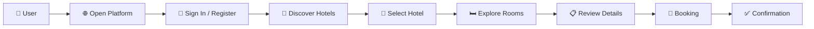
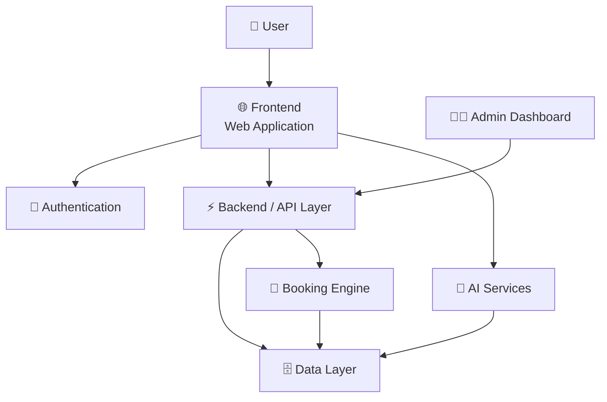
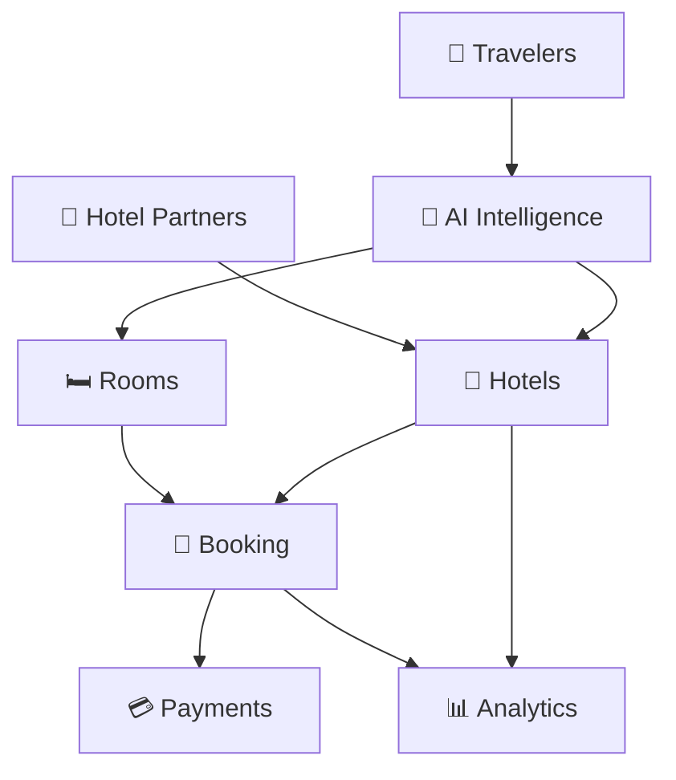

    #HOTEL BOOKING APP

<p align="center">
  
  
  
</p>

<p align="center">
  <strong>🌐 AI-powered hotel discovery, room exploration & smart hospitality.</strong>
</p>

<p align="center">
  <a href="https://ai-hotels-rooms.vercel.app/">
    
  </a>
</p>

---

## 🌟 Experience the Platform

**AI Hotels & Rooms** is a modern full-stack hospitality platform designed to transform the way users discover hotels and explore rooms.

Instead of making hotel discovery complicated, the platform focuses on a simple product philosophy:

> ### **Discover → Explore → Choose → Stay**

Built with a modern UI, scalable architecture, and an AI-first product vision, AI Hotels & Rooms is designed as a foundation for the next generation of intelligent hospitality applications.

---

## 🎬 Live Preview

<p align="center">
  <a href="https://ai-hotels-rooms.vercel.app/">
    
  </a>
</p>

🔗 **Live Application:**
https://ai-hotels-rooms.vercel.app/

---

# ✨ What Makes It Different?

AI Hotels & Rooms is not designed as just another hotel listing website.

It is built around the idea of combining:

```text
                 🏨 HOSPITALITY
                       │
                       ▼
              ┌─────────────────┐
              │ AI HOTELS        │
              │ & ROOMS          │
              └─────────────────┘
                 ▲      ▲      ▲
                 │      │      │
                AI     UX     DATA
                 │      │      │
                 ▼      ▼      ▼
          🤖 Intelligence
          🎨 Experience
          📊 Insights
```

### 🎯 Product Vision

**Make hotel discovery intelligent, personalized, and effortless.**

---

# 🚀 Core Features

<table>
<tr>
<td width="50%">

### 🏨 Hotel Discovery

Explore hotels through a clean and modern discovery experience.

</td>
<td width="50%">

### 🛏️ Room Exploration

View available room options and make better stay decisions.

</td>
</tr>

<tr>
<td>

### 🔎 Smart Search

Find relevant stays quickly with an intuitive search experience.

</td>
<td>

### 👤 User Experience

Designed around a smooth and straightforward user journey.

</td>
</tr>

<tr>
<td>

### 📱 Responsive Design

Optimized for desktop, tablet, and mobile experiences.

</td>
<td>

### ⚡ Modern Architecture

Built with scalability and future expansion in mind.

</td>
</tr>

<tr>
<td>

### 🔐 Security Focus

Designed with authentication and application security in mind.

</td>
<td>

### 🤖 AI-Ready

Architecture designed to support intelligent hospitality features.

</td>
</tr>
</table>

---

# 🧠 AI-First Vision

The biggest opportunity isn't simply **searching for hotels**.

It's allowing AI to understand **what the traveler actually wants**.

Imagine:

```text
👤 "I need a peaceful hotel near the beach
    for 3 nights under ₹5,000."

                    ↓

              🤖 AI ENGINE

                    ↓

        Understand Preferences
                    +
             Analyze Hotels
                    +
             Compare Rooms
                    +
           Rank Best Options

                    ↓

        🏆 Personalized Results
```

### Future AI capabilities

| AI Capability            | Purpose                                    |
| ------------------------ | ------------------------------------------ |
| 🤖 Smart Recommendations | Recommend hotels based on user preferences |
| 💬 AI Travel Assistant   | Conversational hotel discovery             |
| 🧠 Preference Learning   | Understand user behavior                   |
| 🎯 Room Recommendation   | Suggest the most suitable room             |
| 📍 Location Intelligence | Recommend stays based on location          |
| 💰 Price Intelligence    | Analyze pricing patterns                   |
| ⭐ Smart Ranking          | Rank hotels based on relevance             |
| 🗺️ AI Itinerary         | Generate personalized travel plans         |

---

# 🔄 User Journey



---

# 🏗️ System Architecture



---

# 📊 Platform Architecture

### Frontend Layer

```text
┌─────────────────────────────────┐
│          PRESENTATION            │
├─────────────────────────────────┤
│ 🏠 Home                         │
│ 🔎 Search                       │
│ 🏨 Hotels                       │
│ 🛏️ Rooms                        │
│ 👤 Authentication               │
│ 📅 Booking                      │
│ ⚙️ User Dashboard               │
└─────────────────────────────────┘
```

### Backend Layer

```text
┌─────────────────────────────────┐
│          APPLICATION             │
├─────────────────────────────────┤
│ 🔐 Authentication               │
│ 🏨 Hotel Services               │
│ 🛏️ Room Services                │
│ 📅 Booking Services             │
│ 🤖 AI Services                  │
│ 📊 Analytics                    │
└─────────────────────────────────┘
```

### Data Layer

```text
        ┌──────────────┐
        │ 🗄️ DATABASE  │
        └──────┬───────┘
               │
      ┌────────┼────────┐
      ▼        ▼        ▼
   Hotels    Rooms   Users
      │        │        │
      └────────┼────────┘
               ▼
           Bookings
```

---

# 🎨 Design Philosophy

The interface follows a simple principle:

> **Luxury doesn't need complexity.**

### Design priorities

* ✨ Clean visual hierarchy
* 🧭 Simple navigation
* 📱 Mobile-first thinking
* 🎯 Clear calls-to-action
* 🖼️ Visual hotel discovery
* ⚡ Minimal friction
* ♿ Accessibility-aware design
* 🧩 Reusable UI components

---

# 📱 Responsive Experience

| Device      | Support |
| ----------- | :-----: |
| 🖥️ Desktop |    ✅    |
| 💻 Laptop   |    ✅    |
| 📱 Mobile   |    ✅    |
| 📲 Tablet   |    ✅    |

The interface is designed to adapt across screen sizes without compromising the core experience.

---

# 🛡️ Security Strategy

Security is considered a first-class requirement.

### 🔐 Application Security

* Secure authentication
* Protected user workflows
* Input validation
* Secure API communication
* Environment-based secrets
* Authorization controls
* Secure data handling
* Production-ready security practices

> **Never commit API keys, credentials, database passwords, or other secrets to the repository.**

---

# ⚡ Performance Philosophy

The application is designed around:

```text
FAST
 ↓
RESPONSIVE
 ↓
SIMPLE
 ↓
SCALABLE
 ↓
RELIABLE
```

Performance priorities include:

* ⚡ Fast page loading
* 📦 Efficient asset handling
* 🧩 Component reusability
* 📱 Responsive rendering
* 🚀 Production deployment optimization

---

# 🧰 Technology Stack

## 💻 Application

The project uses a modern web application architecture with a focus on:

```text
Frontend
   │
   ├── 🎨 Modern UI
   ├── 📱 Responsive Design
   └── ⚡ Interactive Experience
             │
             ▼
Backend
   │
   ├── 🔐 Authentication
   ├── 🏨 Hotel Services
   ├── 🛏️ Room Services
   └── 📅 Booking Services
             │
             ▼
Data
   │
   ├── 👤 Users
   ├── 🏨 Hotels
   ├── 🛏️ Rooms
   └── 📅 Reservations
```

### ☁️ Deployment

<p align="center">


</p>

---

# 📂 Project Structure

```text
AI-Hotels-Rooms/
│
├── 📁 public/
│   ├── 🖼️ images/
│   ├── 🎨 assets/
│   └── 📄 icons/
│
├── 📁 src/
│   ├── 📁 components/
│   ├── 📁 pages/
│   ├── 📁 services/
│   ├── 📁 hooks/
│   ├── 📁 utils/
│   └── 📁 styles/
│
├── 📄 package.json
├── 📄 README.md
├── 📄 .env.example
├── 📄 .gitignore
└── 📄 LICENSE
```

---

# 🚀 Getting Started

## 1. Clone the repository

```bash
git clone <YOUR_REPOSITORY_URL>
cd AI-Hotels-Rooms
```

## 2. Install dependencies

```bash
npm install
```

## 3. Configure environment variables

Create:

```text
.env
```

Example:

```env
DATABASE_URL=
AUTH_SECRET=
API_KEY=
```

⚠️ **Do not expose production credentials.**

## 4. Start development server

```bash
npm run dev
```

## 5. Build for production

```bash
npm run build
```

---

# 🗺️ Roadmap

## 🟢 Phase 01 — Foundation

* [x] Modern hotel interface
* [x] Responsive UI
* [x] Hotel discovery
* [x] Room exploration
* [x] Initial deployment

## 🟡 Phase 02 — Full-Stack Platform

* [ ] Complete authentication
* [ ] User profiles
* [ ] Hotel database
* [ ] Room availability
* [ ] Booking system
* [ ] Booking history
* [ ] User dashboard

## 🔵 Phase 03 — AI Intelligence

* [ ] AI hotel recommendations
* [ ] AI travel assistant
* [ ] Natural-language search
* [ ] Personalized recommendations
* [ ] Intelligent hotel ranking
* [ ] AI itinerary generation

## 🟣 Phase 04 — Scale

* [ ] Payment gateway
* [ ] Admin dashboard
* [ ] Hotel partner portal
* [ ] Analytics dashboard
* [ ] Notification system
* [ ] Advanced security
* [ ] Performance monitoring

---

# 📈 Future Ecosystem

The long-term vision can evolve into a complete hospitality ecosystem:



---

# 💡 Product Opportunities

AI Hotels & Rooms can eventually expand beyond hotel booking into:

### 🌍 Travel Intelligence

Personalized travel planning based on:

* Budget
* Location
* Duration
* Interests
* Travel style

### 🤖 AI Concierge

A conversational assistant capable of helping users:

```text
Find a hotel
     ↓
Choose a room
     ↓
Plan activities
     ↓
Build itinerary
     ↓
Manage stay
```

### 📊 Hospitality Analytics

Hotel owners could gain insights into:

* Occupancy
* Demand
* Room performance
* Customer preferences
* Pricing trends
* Booking patterns

---

# 🧪 Development Principles

This project follows a product-oriented engineering mindset:

```text
User First
    ↓
Simple UX
    ↓
Clean Architecture
    ↓
Secure Implementation
    ↓
Scalable Infrastructure
    ↓
Continuous Improvement
```

---

# 🤝 Contributing

Contributions are welcome.

### Fork

```bash
git fork
```

### Create a branch

```bash
git checkout -b feature/amazing-feature
```

### Commit

```bash
git commit -m "feat: add amazing feature"
```

### Push

```bash
git push origin feature/amazing-feature
```

Then open a **Pull Request** 🚀

---

# 🐛 Issues & Feature Requests

Found a bug?

Have an idea?

Want to improve the platform?

Open an issue and let's build it.

---

# 📜 License

This project is currently intended for development and educational purposes.

Add an appropriate open-source license before distributing the project under formal open-source terms.

---

# 👨‍💻 Built By

<p align="center">

### Aravind

**AI • Full Stack • Software Engineering • Product Development**

</p>

---

# 🌐 Connect With The Project

<p align="center">

<a href="https://ai-hotels-rooms.vercel.app/">

</a>

</p>

---

# ⭐ Support The Project

If you like **AI Hotels & Rooms**:

⭐ Star the repository
🍴 Fork the project
🐛 Report bugs
💡 Suggest features
🤝 Contribute

Every contribution helps move the project forward.

---

<p align="center">

## 🏨 AI HOTELS & ROOMS

### **Discover Smarter. Stay Better.**

**The next generation of intelligent hospitality starts here. 🚀**

</p>

---

<p align="center">
  <sub>Built with curiosity, engineering, and a vision for smarter travel.</sub>
</p>
